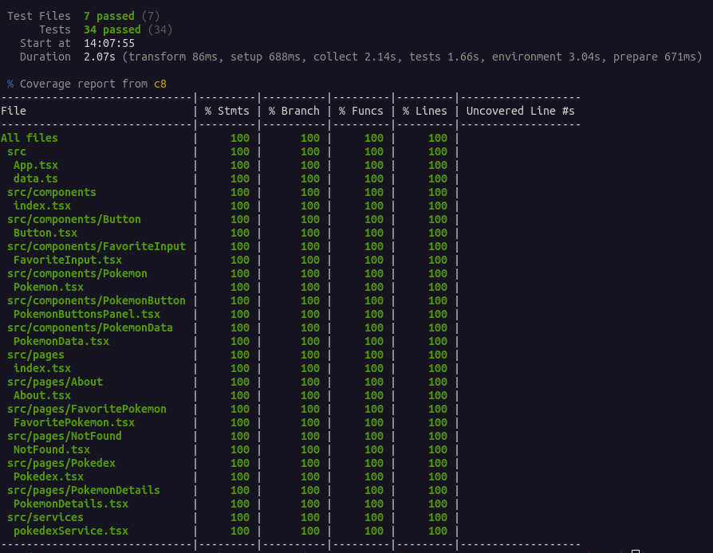
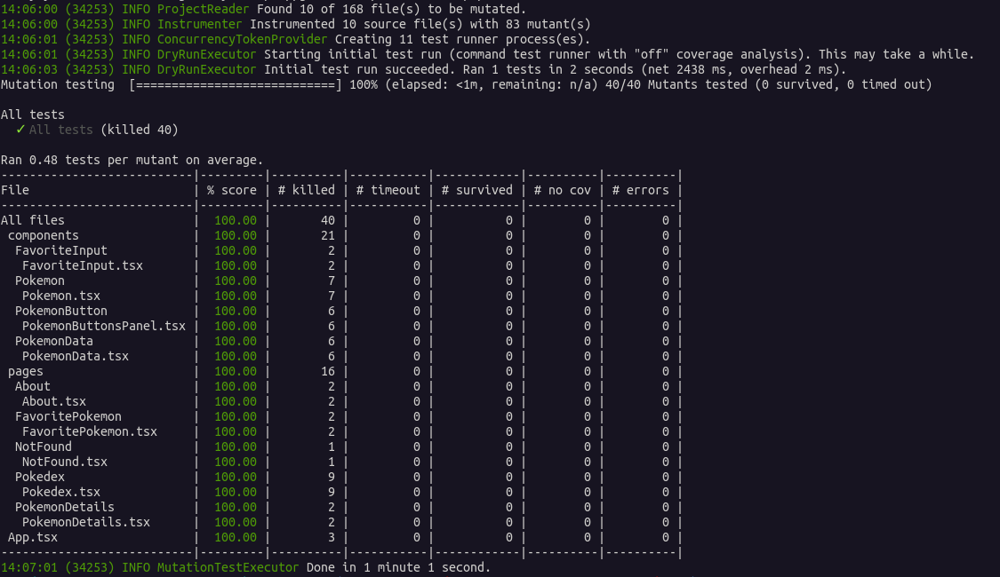

# <p align="center">Projeto React Testing Library</p>

## Contexto

Esse projeto é uma aplicação já pronta disponibilizada pela [Trybe](https://betrybe.com), a Pokédex, objetivo é utilizar `React-Testing-Library` e `Vitest` para escrever os testes. Sendo todos os testes passando em 100% dos casos de uso/mutações criados pelo `Stryker Mutator`.

<details>

<summary><strong>Rode o projeto localmente</strong></summary><br>

> ⚠️ É preciso ter o [Node](https://nodejs.org/en) instalado em sua máquina.

Clone o repositório:

```SHELL
git clone git@github.com:mairess/project-react-testing-library.git
```

Instale as dependências:

```SHELL
npm install
```

Inicie o vite server:

```SHELL
npm run dev
```

### Os testes

Rode os testes com:

```SHELL
npm test
```

Rode um teste específico:

```SHELL
npm run test About.test.tsx
```

Rode a cobertura dos testes:

```SHELL
npm run coverage
```

</details>

<details>

<summary><strong>Rode o projeto com o docker</strong></summary><br>

> ⚠️ É preciso ter o [Docker](https://www.docker.com/get-started/) instalado em sua máquina.

Clone o repositório:

```SHELL
git clone git@github.com:mairess/project-react-testing-library.git
```

Suba o container:

```SHELL
docker compose up -d
```

O vite server estará disponível na porta `3000`:

```HTML
http://localhost:3000
```

### Os testes

Rode os testes com:

```JSON
npm test
```

Rode um teste específico:

```JSON
npm run test About.test.tsx
```

Rode a cobertura dos testes:

```JSON
npm run coverage
```

</details>

### cobertura vitest



### cobertura stryker



## Competências desenvolvidas

- Capacidade para usar seletores da `React-Testing-Library` em testes automatizados.
- Capacidade para testar usando `vitest`.
- Capacidade de `simular eventos`.
- Capacidade de testar fluxos lógicos assíncronos.
